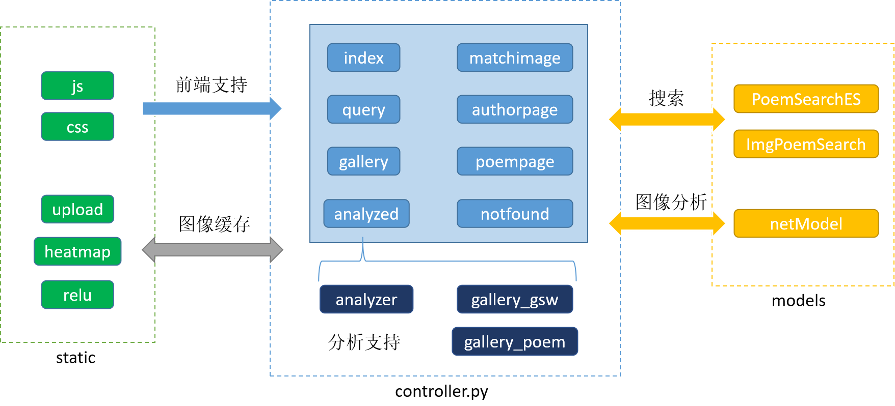
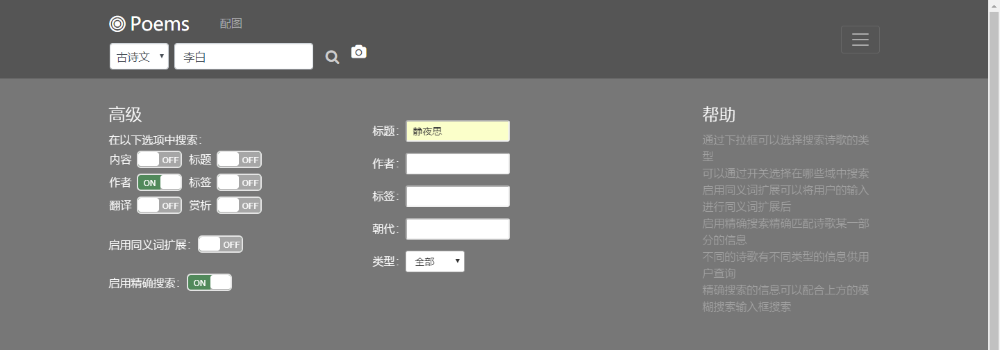
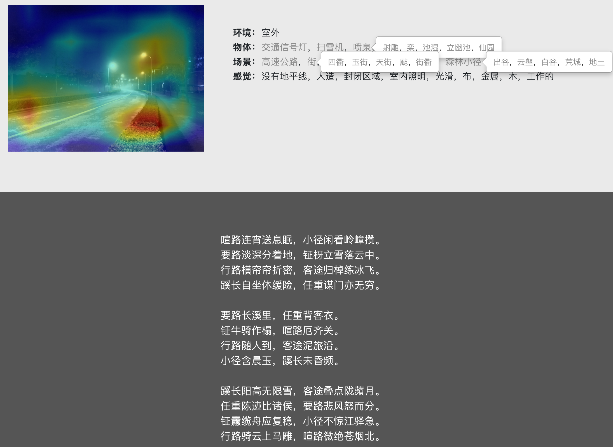

# EECourse-Poem-Project

## 项目综述
Poem Inspire是一个功能丰富诗歌搜索网站。它涵盖了全部诗经、唐宋古诗30万余首、宋词元曲等2万余首、中文现代诗5千余首、英文现代诗1万余首、诗歌配图约18万张、赏析5千余篇，以及相应的2万余名诗人信息、1万余个标签。

我们实现的具体功能包括：
+ **信息整合**：对每首诗提供信息页面，包括正文、作者、意象、标签、年代、自动配图，有助于读者对一首诗产生直观印象；
+ **分类查看**：对作者、流派、标签等制作专门页面，方便用户阅读研究该类别下的诗歌；
+ **模糊搜索**：将用户的输入对标题、正文、赏析等多个搜索域进行搜索，展现全面的内容；
+ **精确搜索**：集成在在高级搜索的多个选择框内，用户可指定对某类诗的某个域搜索；
+ **词义联想**：考虑到用户输入现代汉语与古诗词的差异性，我们实现了古词联想，比如输入“酒店”，联想到“逆旅 酒楼 客舍 酒肆 旅亭 馆驿 帆宿 客馆 酒家 炊烟 厨香 杏花村...”；
+ **自动配图**：用户输入某首诗，将分析其表达的意象，并返回主题最适合的配图；
+ **以图搜诗**：用户上传一张图片，将分析图片包含的物体、场景、情感信息，搜索返回与图片最相符合的诗歌；
+ **以图写诗**：用户上传一张图片，并可以自由选择特征信息，自动从图片生成现代诗、绝句及律诗。
+ **每日推荐**：主页每日推荐，包括横幅诗图、古诗现代诗推荐、标签推荐等；

## 网站架构
我们采用Bootstrap作为前端的框架，利用Javascript实现了与模型有关的部分的前后端的异步交互，后端利用web.py实现对网页前端的支持，使用高效的elastic-search实现数据的索引和搜索。

我们使用额外数据和词频分析建立了现代诗和古诗的词典和TF-IDF词典，并借助jieba的有关功能实现了现代诗和古诗文的文本分析和关键词抽取。我们使用深度卷积神经网络实现了图片到物象的转化以及建立图片与诗歌间的联系从而实现为诗歌配图、由图片搜索和生成现代诗和古诗文。

我们的网站采用了一定的MVC分离。PoemSeachES和netModel及model文件夹下的模型为搜索引擎的模型部分，负责对controller发出的查询请求做出响应和进行图像处理。controller.py为我们的控制器，图中由淡蓝色矩形框出的类都有对应的前端页面，深蓝色标出的三个类通过前端的javascript进行动态加载，异步返回数据。static是web.py框架下网站的资源文件夹，其中的js文件夹和css文件夹包含了支持前端布局的js文件和css文件，其余三个文件夹用于缓存用户上传和图像处理中间结果的图片。

## 数据来源
项目诗歌来源包括中国诗歌网、诗歌大全文库、古诗文网等，包括现代诗与古诗这两大门类。图片来源除了上述中国诗歌网的诗影栏目，还有veer图库。

## 索引及搜索
我们利用ElasticSearch作为索引和搜索的工具。我们分别为古诗和现代诗建立了索引，包含标题、作者、正文、配图等字段，并对标题和正文采用细粒度分词索引。此外，我们还利用后续获得的作者、新增配图信息等更新索引。

诗歌文本搜索通过布尔查询和分页查询的方法实现。诗图互搜和自动配图通过诗歌的关键词和图的联想词的文本互搜实现。图片联想词通过下文[图像特征提取](#图像特征提取)中获得标签后进行近义词扩展得到。诗歌的关键词通过tf-idf算法和TextRank算法抽取。

对于古代诗词，将通过下文的[特征语义扩展](#特征语义扩展)获得古词热词库和古词-现代词联想库。

## 图像特征提取
这一步对传入图片进行卷积神经网络运算，得到多分类预测，包括图片的物体、场景和情态特征。

对于图片的object特征，我们使用了\href{http://www.cs.toronto.edu/~frossard/post/vgg16/}{基于ImageNet训练的vgg16结构}，直接由最后一个全连接层的softmax输出得到对1000分类的object信息预测。而对于图片的scene和emotion信息，我们使用了\href{http://places2.csail.mit.edu/PAMI_places.pdf}{基于Places365训练的ResNet18结构}来预测，并通过后期处理得到。

同时，为了增强该cnn网络的可解释性，还钩取了中间层，并与最后softmax层的权重向量点乘，分析得到结果矩阵中的触发峰，然后将该结果矩阵以热力图的方式覆盖，用户就可以看到原图各区域对结果的触发程度。

## 特征语义扩展
通过上一步骤的cnn我们已经得到了图片的特征信息，但输出的特征最终需要用语言来展示。原数据集（ImageNet和Places365）中的标签均是英文，直接翻译成中文也是现代汉语，无法直接用以搜索或生成古词。

为此，我们利用清代刘文蔚《诗学含英》这一包含古代词语、意象的分类工具书，以及哈工大的《同义词词林》的关于现代汉语的词语分类结构，通过对每个级别分配权重并将词义间关联用编码的向量余弦角表示的方法，可以求得现代汉语之间的词义相似度。由此，我们构造了现代汉语和古词两个森林结构。

为获得古词和现代汉语之间的联系，我们采用回译的方法，讲每个古词先翻译成英文，再翻译回现代汉语，通过词林中选取前k个近义词，这样就有k+1个现代词获得了古词的联系。通过此方法，每个现代词都大约获得10个古词联系。一些例子如下表（古词按关联度排序）：

| 现代汉语 | 古词 |
| -- | -- |
| 山雀 | 山鸟，啄木，鹭鸥，鹭，鸳鹭，鸥鹭，栖鹭，鹭鹚... |
| 山间小路 | 云壑，谷，万壑寒，春山，四隅，阡陌，客路长，林霭，幽径... |
| CD播放器 | 为盘，声频，佛阁，拖荇带，书带，碧筒，兰缸，仙机... |
| 轿车轿厢内 | 翔车，车盖，车似，车驻，车咸，万车，车前，盈车，野马，凤胎... |
| 清洁的 | 洁身，轻清，清游，淡净，致洁，似冰清，心与洁，楚楚... |
| 崎岖的 | 崎岖，峻岭，峭壁，险峻，亘地蟠，浪未平，奔崖，景难... |

## 古诗文生成
### 训练模型
考虑到诗（尤其是绝句、律诗等）在形式、断句上较为规整，我们本次实验中只采用诗来训练网络。我们参考了2014年发表在EMNLP上的论文[Chinese Poetry Generation with Recurrent Neural Network](http://aclweb.org/anthology/D/D14/D14-1074.pdf)，并最终使用了基础的LSTM模型，在TensorFlow模板上进行修改，后接一个softmax输出接下来某字的出现概率。设置2个循环隐藏层，隐藏细胞hidden\_units=128。设置学习率为0.001，并使用了TensorFlow中的衰减策略，设learningRateDecayStep = 1000，learningRateDecayRate = 0.95。损失函数设计为预测字符和语料中实际字符的交叉熵。

训练环境：Ubuntu18.04, TensorFlow1.12.0, CUDA9；四路GeForce GTX 1080Ti。总共对30万首诗训练50个epoch，共耗时约三天。

训练结果：Error Function从开始的1.9降至0.1左右。

### 生成诗歌
由某个关键字开头后，接下来每个字得到的概率向量来自之前的已有全部文段。对概率向量进行直方图统计操作，并按照概率权重随机取字，直至生成结束符，即可生成一首诗。LSTM网络可以直接生成整首诗，但为了让生成诗更加具有用户可控性，控制整体诗歌的氛围特征，我们允许用户自行加入古词关键词在各个句子中引导生成。古诗关键词的加入来自上一部分的词义联想扩展功能。

同时，我们发现该LSTM网络生成的诗歌在押韵平仄等音韵特征方面不够好，我们对生成的softmax预测概率加入了音韵惩罚。我们获取了汉字的拼音数据集，并对于生成诗歌的某些特定部位（如一三五不论、二四六分明的句尾、奇数关节）的汉字与前文的韵母和平仄进行比对，如果不符合正确的押韵及平仄规则，softmax概率乘以一个小于1的惩罚权重。另外，考虑到目前还学不到如“凄凄惨惨戚戚”的程度，生成的叠词往往造成无意义病句，我们也加入了叠词惩罚。

## 现代诗生成
现代诗的生成我们没有自己训练模型，而是直接参考了来自京都大学和微软亚研院的ACM MM2018的最佳论文(Beyond Narrative Description: Generating Poetry from Images by Multi-Adversa)[https://arxiv.org/pdf/1804.08473.pdf]，并使用了该论文的开源模型。