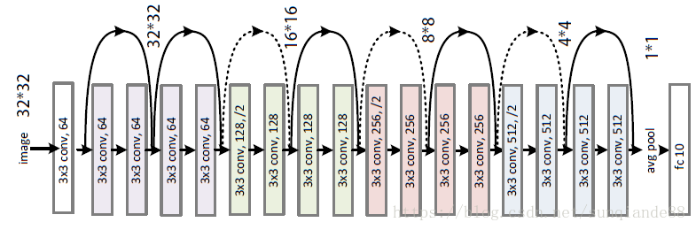
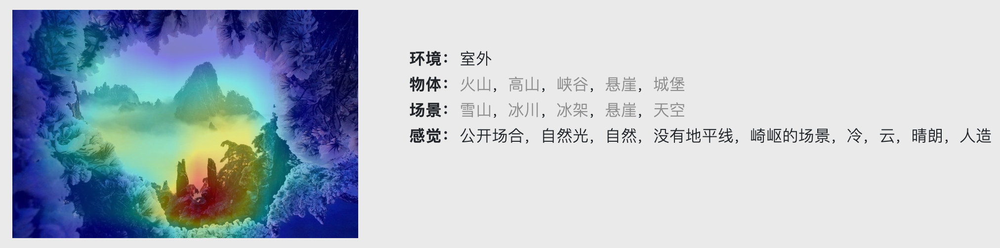
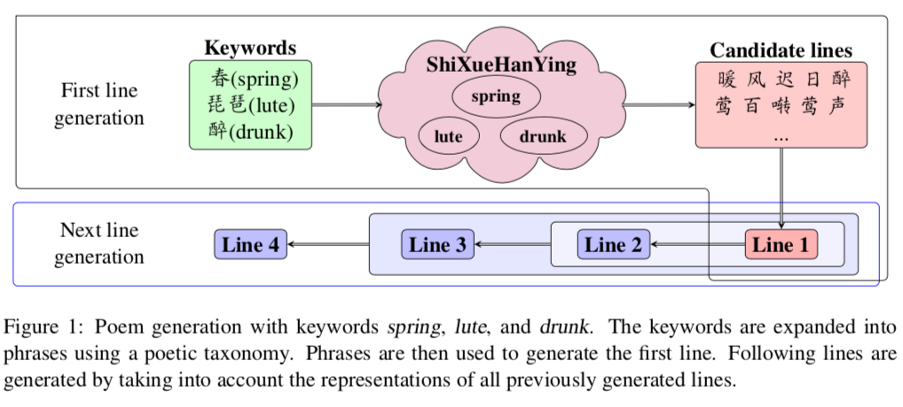
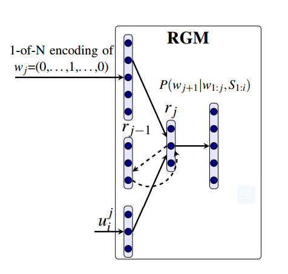
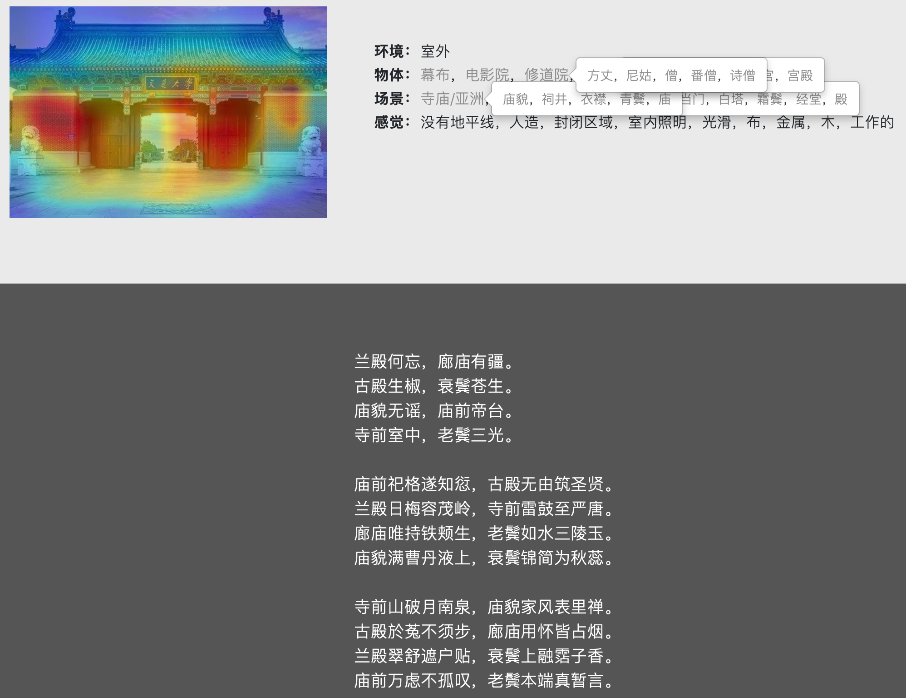
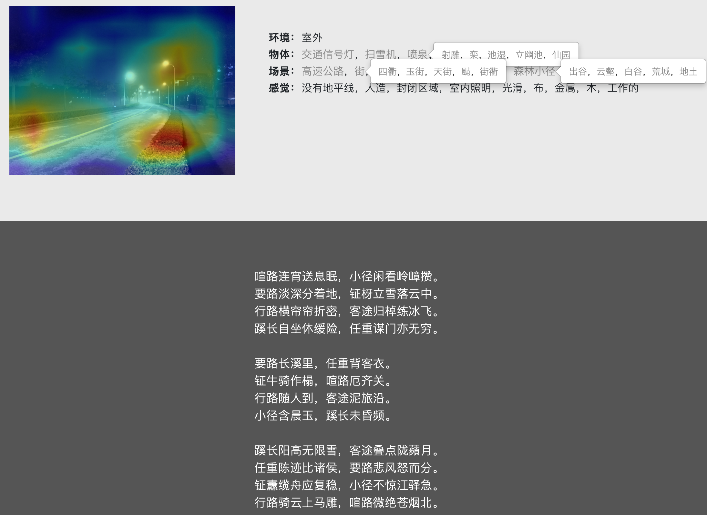
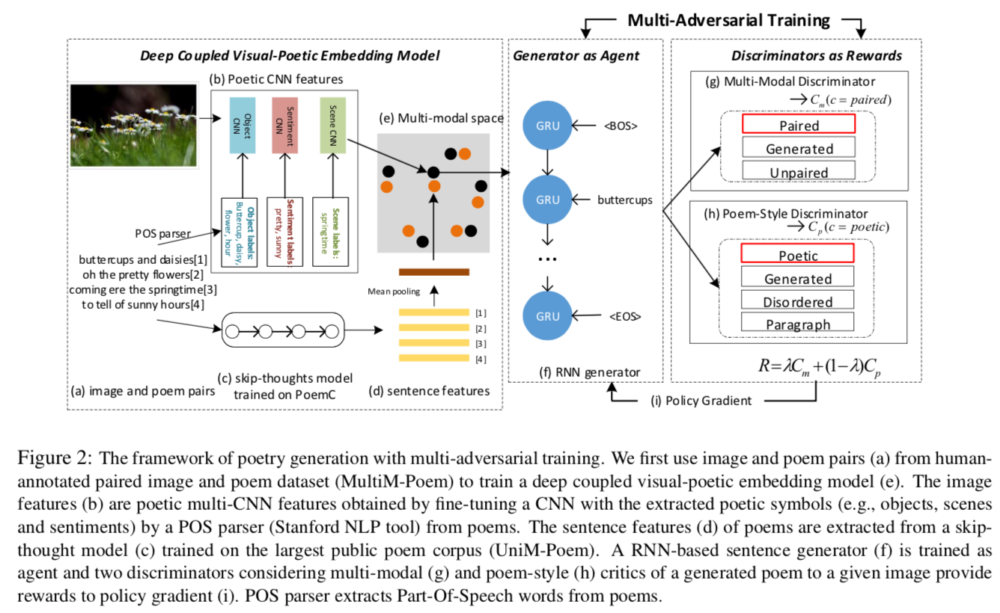
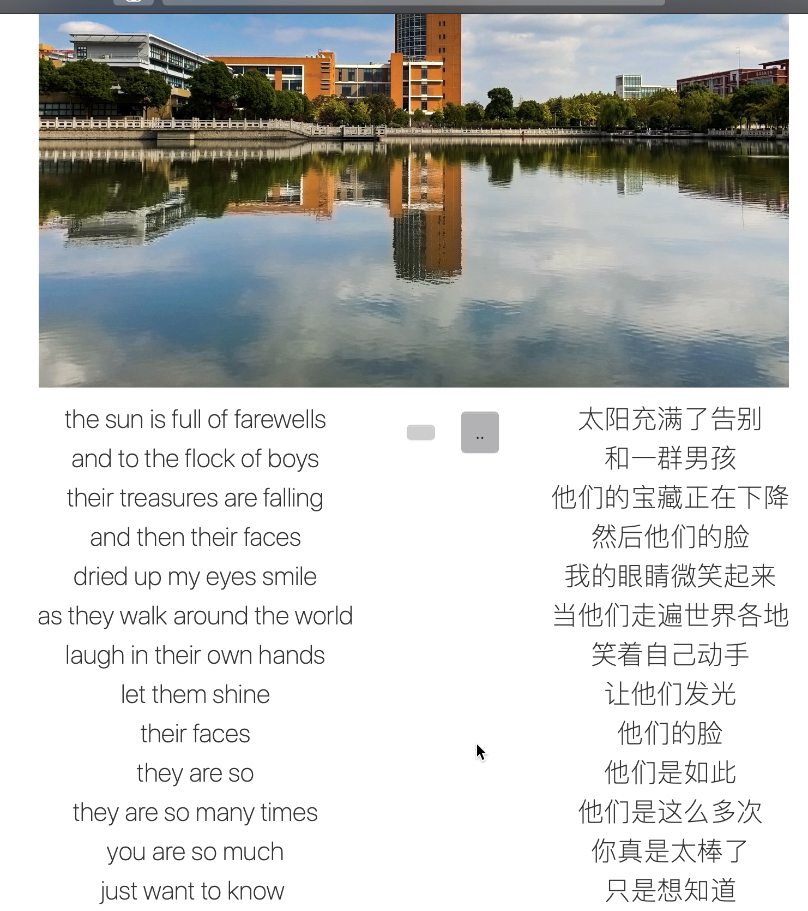

#<center>Poem Inspire实验报告</center>

## 1.项目综述

读诗是一种美好的享受。但目前网络上的诗歌库，比如中国诗歌网、古诗文网等，要么是数据量较小，要么是表单样式的网站，没有丰富的功能。我们希望将诗歌用一种更好的形式展现给用户，因此利用本学期电工导知识实现了此诗歌引擎：Poem Inspire。

该引擎数据量涵盖了全部诗经、唐宋古诗30万余首、宋词元曲等2万余首、中文现代诗5千余首、英文现代诗1万余首、诗歌配图约20万张、赏析5千余篇，以及相应的2万余名诗人信息、1万余个标签。

我们实现的功能包括：

+ **信息整合**：对每首诗提供信息页面，包括正文、作者、意象、标签、年代、自动配图，有助于读者对一首诗产生直观印象；
+ **分类查看**：对作者、流派、标签等制作专门页面，方便用户阅读研究该类别下的诗歌；
+ **模糊搜索**：将用户的输入对标题、正文、赏析等多个搜索域进行搜索，展现全面的内容；
+ **精确搜索**：集成在在高级搜索的多个选择框内，用户可指定对某类诗的某个域搜索；
+ **词义联想**：考虑到用户输入现代汉语与古诗词的差异性，我们实现了古词联想，比如输入“酒店”，联想到“逆旅 酒楼 客舍 酒肆 旅亭 馆驿 帆宿 客馆 酒家 炊烟 厨香 杏花村...”；
+ **自动配图**：用户输入某首诗，将分析其表达的意象，并返回主题最适合的配图；
+ **以图搜诗**：用户上传一张图片，将分析图片包含的物体、场景、情感信息，搜索返回与图片最相符合的诗歌；
+ **以图写诗**：用户上传一张图片，并可以自由选择特征信息，自动从图片生成现代诗、绝句及律诗。
+ **每日推荐**：主页每日推荐，包括横幅诗图、古诗现代诗推荐、标签推荐等；
+ ...

## 2.（你们的部分）

## 3.图片-诗歌生成模型

整个图片生成诗歌的步骤可分为三步：图像特征提取、特征词义扩展和诗歌生成。

####3.1.图像特征提取

对传入图片进行卷积神经网络运算，得到多分类预测，包括图片的物体、场景和情态特征。在电工导课堂上我们学习图像处理中的如sift算子、sobel算子等，也可以理解为单层的卷积操作。

我们使用了[基于ImageNet训练的vgg16结构](http://www.cs.toronto.edu/~frossard/post/vgg16/)来预测图片的object特征。直接由最后一个全连接层的softmax输出得到对1000分类的object信息预测。
<center>


<font color='DarkGray'>vgg16网络结构</font>



<font color='DarkGray'>resNet18网络结构</font>
</center>


而对于图片的scene和emotion信息，我们使用了[基于Places365训练的ResNet18结构](http://places2.csail.mit.edu/PAMI_places.pdf)来预测。其中scene信息来自原模型365维的输出，根据原标签事先对室内外的区分，也可以得到平均的室内外判断。利用pyTorch的hook功能，我们钩取了全连接层前的平均池化层的输出，一个512维向量；原网络提供了102*512维关联矩阵，表征avgpool层输出在102个动作情态特征上的关联度、判据，将该关联矩阵和512维向量点乘，就可以得到标签的贡献特征，这些attribute特征具有情态性，我们用它来反映原图的emotion特征。

同时，为了增强该cnn网络的可解释性，还钩取了layer4层，也就是最后一个卷积层在残差层之后的输出，一个512\*14\*14维矩阵，将该矩阵与最后softmax层的权重向量点乘，即是最终权重与该conv层的综合触发，分析得到结果矩阵中的每个点的邻域，得到其featuremap，寻找局部极大值，就认为这是触发峰，也就是原图中相应位置的某些特征对预测结果有较大贡献。然后将该结果矩阵以热力图的方式覆盖，用户就可以看到原图各区域对结果的触发程度。

<center>


<font color='DarkGray'>图像特征抽取展示</font>
</center>

-
####3.2.特征词义拓展

通过上一步骤的cnn我们已经得到了图片的特征信息，但输出的特征最终需要用语言来展示。原数据集（ImageNet和Places365）中的标签均是英文，直接翻译成中文也是现代汉语，比如——

```python
物体：山雀，石榴，CD播放器，巧克力酱...
场景：轿车轿厢内、湖泊、山间小路、海滩...
感觉：清洁的，日光浴、崎岖的、遥远的...
```

这些词语直接翻译是现代汉语，并且具有西式生活色彩。直接以这些词语去搜索或生成古诗显然是愚蠢的，我们没法期望在古诗里搜到‘轿车轿厢内’，也当然不能生成一首古诗，开头是‘CD播放器’。那么如何填补古汉语与现代汉语之间的差异，建立词义拓展的联系呢？

+ **word2vec学习**

初始时我们尝试了用word2vec方法来做近义词拓展。可以理解为用某个长度的滑窗对文本进行卷积，在原文本中位置相距越近的词，我们认为词义上的关联就越大。而每个词用某长度的向量来表示，词义间的关系则通过向量间余弦表示。但是仔细思考后发现这个方法并不可行，因为第一，在这种近义词任务中，简单地以距离作为相似度判据并不可靠，距离只能代表关联性，比如“我”“爱”“你”，“我”和“爱”在文本中关联性较大，但不是近义词。第二，也是最主要的原因，我们很难获取到包含古文和现代词的文段，而直接对所有古诗进行seq2seq学习，也只能得到古文间的词义聚类，并不能和现代汉语产生关联。因此我们考虑另外的方法。

+ **古词库与现代汉语近义词库**

随着继续探究问题，我们发现了两个对解决问题有关键作用的数据库。第一个是《诗学含英》，是清代刘文蔚根据《增广诗韵全璧》一书所附〈诗学含英〉创作的一本工具书，包含了9000余古诗中出现的意象、词语，按照天文、时令、节序、地舆..等分类；另一个数据库是哈工大的《同义词词林》，词林的格式是6级编码，其中前五个是类别级别，大中小类、词群和原子词群，而第6位编码是标记位，注明词语关系。如：

```python
Aa01A02= 人类 生人 全人类
```

利用对每个级别分配权重并将词义间关联用编码的向量余弦角表示的方法，可以求得现代汉语之间的词义相似度。这个功能在Python中有封装好的第三方库`synonym`，我们直接调用了。如果用图的观点来理解，我们已经有了一个边较稠密的现代汉语森林，和一个边较稀疏的古词森林，如何将这两个森林建立联系呢？

+ **利用翻译**

我们考虑对于《诗学含英》中的每一个古词，利用在线翻译将其翻译为英语，借助英语这个中介，再翻译回汉语，就可得到相应的现代文近同义词；再利用同义词林的方法，获得该现代词的前k个同义词（按照相关度即余弦角排序），这样这k+1个现代汉语词就都和该古词建立了对应关系，对应的关联程度按照相关度来定义。遍历所有古词之后，大部分现代汉语就都有了其对应的一群近义古词和相应的相关度。完整的流程比如：

蜜尤香→Honey→蜜糖，蜂蜜→蜂蜜,牛奶,汁,糖浆,果汁,葡萄,水果,马铃薯,肉桂, 杏仁（1.0,0.72741085, 0.72632432, 0.71830636, 0.71781552...）

最终“巧克力酱“、“奶酪软饼“、“馅饼“、“糖酥派“等现代词语都可以联想到古词“蜜尤香”。回到上面展示的几个现代词，联想如下（按照相关度排序）：

| 现代汉语 | 古词 |
| ------ | ------ |
| 山雀 | 山鸟,啄木,鹭鸥,鹭,鸳鹭,鸥鹭,栖鹭,鹭鹚... |
| CD播放器 | 为盘,声频,佛阁,拖荇带,书带,碧筒,兰缸,仙机... |
| 轿车轿厢内 | 翔车,车盖,车似,车驻,车咸,万车,车前,盈车,野马,凤胎... |
| 山间小路 | 云壑,谷,万壑寒,春山,四隅,阡陌,客路长,林霭,幽径... |
| 清洁的 | 洁身,轻清,清游,淡净,致洁,似冰清,心与洁,楚楚... |
| 崎岖的 | 崎岖,峻岭,峭壁,险峻,亘地蟠,浪未平,奔崖,景难... |

使用翻译的方法虽然简单粗暴，但是确实很有用，大多数的现代汉语词最终都匹配到了10个以上的古代同义词，建成了一个哈希散列表直接封装可搜索。这在后续的生成古诗词过程中有用；并且也可以作为一个单独的古今近同义词数据集以便后续研究。我们也参考了[Incorporating Chinese Characters of Words for Lexical Sememe Prediction](https://arxiv.org/abs/1806.06349)这篇论文中建立词义关联的部分。

有趣的是，在爬取翻译的过程中，刚开始我们写的爬取谷歌翻译，由于谷歌翻译的结果并没有直接显示在网页中，而是异步返回的，我们仔细研究写了一个专用的抓包爬虫程序。然而在爬了1000多个词之后，那个程序就坏了，得换另外的ip地址——因为被谷歌的反爬虫机制识别了，对ip进行了封禁。因此最终我们使用了搜狗的翻译api接口，使用付费服务。

+ **词频分析与提取关键词**

目前我们有了《诗学含英》这一庞大的古词数据集，也将古词森林和现代词森林之间建立了意义关联，那么接下来就可以进行词义互联等工作，用于古诗词的分词程序也有了自己的热词库，从而可以提高分词准确率。接下来我们还想对所有古诗词进行词频统计和关键词提取，获得词义间更紧密的联系，用于标签推荐等。

关键词抽取我们使用了课上学习过的TF-IDF算法，也就是Term Frequency*Inverse Document Frequency来表征某词语在全文中的关键程度。

$$TF_{i,j}=\frac{n_{i,j}}{\sum_k{n_{i,k}}}$$，其中TF(i,j)为关键词j在文档i中的出现频率，n(i,j)为关键词j在文档i中出现的次数。

$$IDF_i=\log\frac{|D|}{|j:t_i∈d_j|+1}$$，其中IDF(i)是词语i的反文档频率，|D|是语料库中的文件总数，而|j:t(i)∈d(j)|是出现词语i的文档总数。

同时我们也参考了TextRank算法进行关键词抽取，不需要事先学习训练，简便高效。课上我们学过PageRank算法，TextRank算法正是基于PageRank，将文段按照句子分割并分词和词性标注后，将候选关键词建模成有向有权图，想象一个滑窗（共现窗口）对文段进行卷积运算，A和B的联系，可以定义为从图中点A指向点B的概率（权重），从PageRank的角度理解，就是在A中搜到B的概率，那么按照同样的方法，将该有向图的构造边定义为：两个节点之间存在边仅当它们对应的词汇在长度为K的窗口中共现。

用$$WS(V_i)=(1-d)+d*\sum_{V_j∈In(V_i)}\frac{w_{ji}}{\sum_{V_k∈Out(V_j)}w_{jk}}WS$$（其中In(Vi)为指向Vi的点集合, Out(Vi)为Vi指向的点集合）定义某点$$V_i$$的得分，在上一步骤构造的图中，迭代权重直至收敛，选出最重要的T个词，就是得到的该文段的T个关键词。

-
####3.3.古诗文生成

+ **数据预处理**

考虑到诗（尤其是绝句、律诗等）在形式、断句上较为规整，我们本次实验中只采用诗来训练网络。使用了唐诗+宋诗一共30余万首诗，初步对长度（>14个汉字，<200个汉字）进行筛选、对生僻字（不在9000余字库中）、乱码等进行数据漂洗，然后对每首诗加上开始和结束标识符。这是形式上的统一。

接下来是字符映射，对每个字进行字频统计后得到其id，建立字符和id之间的映射。需要注意，对于标点符号同样要赋值id，因为在接下来的学习中没有过多的人工干预，希望模型能自己学出断句规律。另外，由于诗歌长度不同，需要填补空格id。对于每首诗构建其poem vector，即所有字（和空格凑成该batch中最长诗长度）的id组成，投入接下来的网络中进行训练。

+ **LSTM训练**

首先划分训练集和测试集，trainRatio=0.8，即每次迭代内80%的数据用于训练，20%用于测试。然后构建训练batch，每个batch由64首诗构成。LSTM在文本生成等NLP任务中使用十分广泛，本质可以联系到概率论中的hmm模型等，但每个接下来单元的概率不仅与前n个有关，而是与整个前文有关，并设置了dropout层进行遗忘或增加信息等。具体原理此处不赘述。

<center>


<font color='DarkGray'>参考论文中使用的Keyword Expansion</font>



<font color='DarkGray'>参考论文中使用的Recurrent Generation Model</font>
</center>

我们参考了2014年发表在EMNLP上的论文[Chinese Poetry Generation with Recurrent Neural Network](http://aclweb.org/anthology/D/D14/D14-1074.pdf)，并最终使用了基础的LSTM模型，在TensorFlow模板上进行修改，后接一个softmax输出接下来某字的出现概率。设置2个循环隐藏层，隐藏细胞hidden_units=128。设置学习率为0.001，并使用了TensorFlow中的衰减策略，设learningRateDecayStep = 1000，learningRateDecayRate = 0.95。损失函数设计为预测字符和语料中实际字符的交叉熵。

训练环境：Ubuntu18.04, TensorFlow1.12.0, CUDA9；四路GeForce GTX 1080Ti。总共对30万首诗训练50个epoch，共耗时约三天。

训练结果：Error Function从开始的1.9降至0.1左右。（忘了保存训练曲线..）

+ **诗歌生成**

由某个关键字开头后，接下来每个字得到的概率向量来自之前的已有全部文段。对概率向量进行直方图统计操作，并按照概率权重随机取字，直至生成结束符，即可生成一首诗。LSTM网络可以直接生成整首诗，但为了让生成诗更加具有用户可控性，控制整体诗歌的氛围特征，我们允许用户自行加入古词关键词在各个句子中引导生成。古诗关键词的加入来自上一部分的词义联想扩展功能。

同时，我们发现该LSTM网络生成的诗歌在押韵平仄等音韵特征方面不够好，我们对生成的softmax预测概率加入了音韵惩罚。我们获取了汉字的拼音数据集，并对于生成诗歌的某些特定部位（如一三五不论、二四六分明的句尾、奇数关节）的汉字与前文的韵母和平仄进行比对，如果不符合正确的押韵及平仄规则，softmax概率乘以一个小于1的惩罚权重。另外，考虑到目前还学不到如“凄凄惨惨戚戚”的程度，生成的叠词往往造成无意义病句，我们也加入了叠词惩罚。

<center>


<font color='DarkGray'>从交大庙门生成诗歌</font>



<font color='DarkGray'>从电院草坪夜路生成诗歌</font>
</center>

在2 GHz Intel Core i5的Macbook Pro上测试，平均每首诗生成时间0.1s，可以接受。

-
####3.4.现代诗生成
+ **多对抗训练模型**

现代诗的生成我们没有自己训练模型，而是直接参考了来自京都大学和微软亚研院的ACM MM2018的最佳论文[Beyond Narrative Description: Generating Poetry from Images by Multi-Adversa](https://arxiv.org/pdf/1804.08473.pdf)，并使用了该论文的开源模型。致谢!

在数据准备上，该现代诗生成模型的数据集分为小部分的多模态诗集（诗+图）和大量的单模态诗集（仅诗），为了扩大有效的多模态数据集，作者首先研究了使用图像CNN特点的deep coupled视觉-诗意嵌入模型，然后利用这一嵌入模型，在单模态诗集中队特征点检索，得到扩大的多模态数据集。

<center>


<font color='DarkGray'>该网络的架构</font>
</center>

在训练上，该模型同样分为两个步骤，提取特征和由特征生成诗歌。提取特征首先由三个cnn得到特征，利用deep coupled视觉-诗意嵌入模型，将空间中不同模态的点进行映射，并使用了图像标注叙事技术，认为一对图像和诗歌共享相同的诗歌语义，则诗与图可用诗歌向量来计算关联。而由特征生成诗歌的步骤，采用策略梯度优化的多对抗训练，同时训练来自人工标注的诗-图正确数据集和生成器等不匹配或无序的负面数据集，两个分别针对诗-图匹配和诗歌风格的判别器以RNN为基础，为策略梯度提供激励。

在我们的实际使用上，由于提取特征利用了三个vgg16网络分别得到图片的物品、场景与情感特征，和我们的图像分析步骤相同，为了节省时间，在前序步骤中我们直接hook并传递了最后一个relu层的4096维输出到生成器中。原网络输出的英文诗，我们经过前面写的抓包爬虫，利用谷歌翻译翻译为英文。

<center>


<font color='DarkGray'>从交大图书馆生成现代诗</font>
</center>


## 4.其他

项目分工、github地址等...
